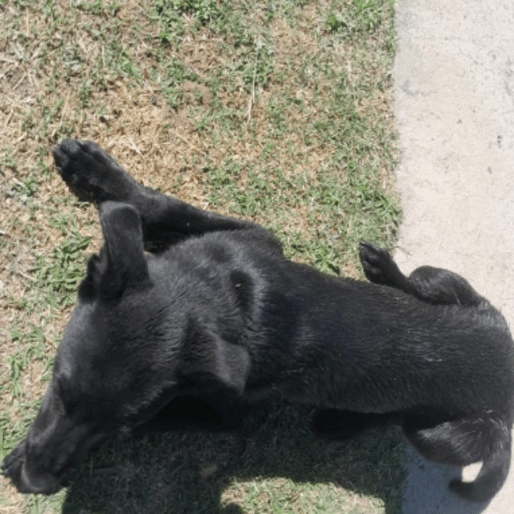

<div align="center">
      <!--  -->
</div>

```
⠀⠀⣸⣿⣿⣿⣿⣿⣿⣿⣿⣿⣿⣿⠀⠀⠀⢀⣾⣿⣿⣿⣿⣿⣿⣿⣿⣶⣦⡀
⠀⢠⣿⣿⡿⠀⠀⠈⢹⣿⣿⡿⣿⣿⣇⠀⣠⣿⣿⠟⣽⣿⣿⠇⠀⠀⢹⣿⣿⣿
⠀⢸⣿⣿⡇⠀⢀⣠⣾⣿⡿⠃⢹⣿⣿⣶⣿⡿⠋⢰⣿⣿⡿⠀⠀⣠⣼⣿⣿⠏
⠀⣿⣿⣿⣿⣿⣿⠿⠟⠋⠁⠀⠀⢿⣿⣿⠏⠀⠀⢸⣿⣿⣿⣿⣿⡿⠟⠋⠁⠀
⠀⠀⠀⠀⠀⠀⠀⠀⠀⠀⣀⣀⣀⣸⣟⣁⣀⣀⡀⠀⠀⠀⠀⠀⠀⠀⠀⠀⠀⠀
⣠⣴⣶⣾⣿⣿⣻⡟⣻⣿⢻⣿⡟⣛⢻⣿⡟⣛⣿⡿⣛⣛⢻⣿⣿⣶⣦⣄⡀⠀
⠉⠛⠻⠿⠿⠿⠷⣼⣿⣿⣼⣿⣧⣭⣼⣿⣧⣭⣿⣿⣬⡭⠾⠿⠿⠿⠛⠉⠀
```

## About Me

😐 I’m H3.  
☕ I write software.  
🤓 English Gateway B2.  
❤️ Open source lover.  
🍺 I wish you were beer.  
🍔 Currently building cool stuff at Ecomenu.

## Some Skills

<p align="center">
      
      
</p>

<p align="center">
      
</p>
